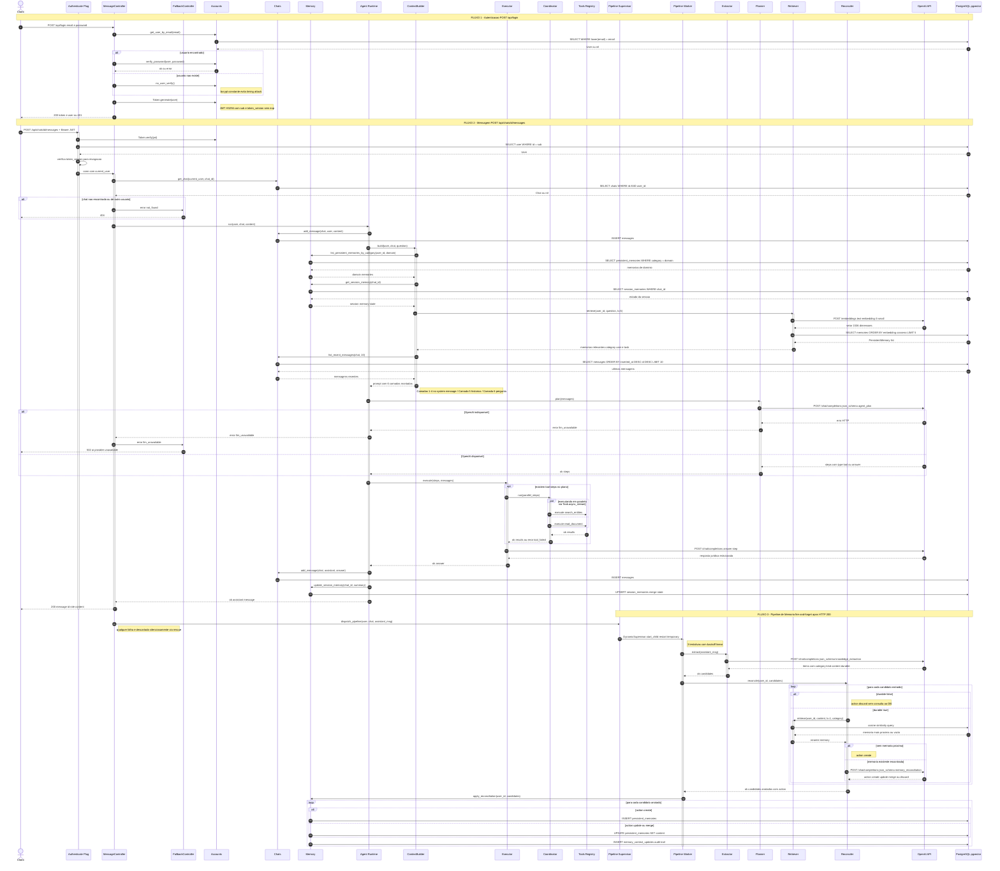

# Diagrama de Sequência — Legal AI Agent Harness

---

## Leitura por camadas

| # | Fluxo | Participantes-chave | Resultado |
|---|-------|---------------------|-----------|
| 1 | Autenticacao | Client, Accounts, Token | JWT HS256 com token_version |
| 2 | Mensagem (sincrono) | Auth Plug, Runtime, CB, Planner, Executor, OpenAI | HTTP 200 com resposta do assistente |
| 3 | Memoria (assincrono) | Worker, Extractor, Reconciler, pgvector | Conhecimento consolidado no DB |

## Propriedades do design

- **Resposta antes da memoria (SC-002):** o HTTP 200 e enviado ao cliente antes do `dispatch_pipeline` iniciar o Worker. Falhas no pipeline nunca afetam o usuario.
- **Planner obrigatorio (FR-010-A):** toda mensagem passa pelo Planner sem bypass. Falha do LLM retorna 502 (`llm_unavailable`), nao 422.
- **Revogacao de tokens sem blocklist:** `token_version` no JWT e comparado com o valor no DB a cada request. Incrementar o campo invalida todos os tokens anteriores.
- **Protecao contra timing attack:** `no_user_verify()` executa bcrypt mesmo quando o e-mail nao existe, garantindo tempo de resposta constante.
- **Fail-total no Coordinator:** se qualquer ferramenta paralela falha, `Task.async_stream` com `reduce_while` interrompe todas as demais imediatamente.
- **Worker efemero (restart: temporary):** o Supervisor nao reinicia Workers que falham. O pipeline tenta ate 3 vezes internamente com backoff linear e depois descarta com log.
